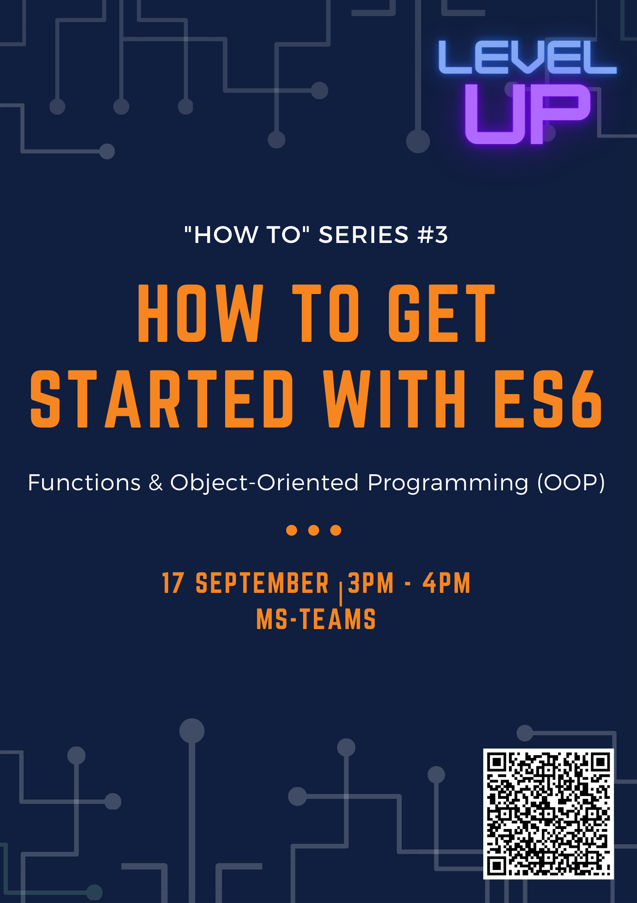

# How To ES6 Functions and OOP

Provided:
- Codes for reference/revision
- File names include a preceding number in reccomendation of order of viewing                                                
- Some commented notes/explanations                                   
- Resource links for optional self-reading/additional understanding                                                     

To download a copy, click Code > Download ZIP
> Reason to use `const` and `let` instead of `var` : https://javascript.info/var    

    
My IDE: Visual Studio Code

    My VS Code UI:                  
    - Colour Theme: Atom One Dark                                   
    - File Icon Theme: Material Icon
    - Product Icon Theme: Default

    Reccomended VS Code plugins:
    - Bracket Pair Colorizer 2
    - Live Server
    - Quokka.js
    - Better Comments
    - htmltagwrap
    - Tabnine AI Code Completion
    - GitLens

